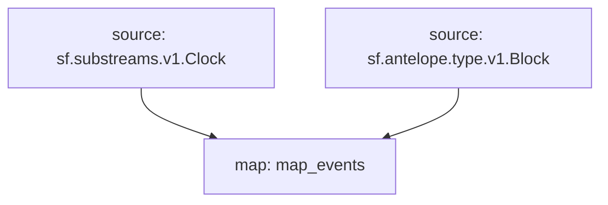

# Antelope `eosio.token` Substream

> Antelope `eosio.token` tokens

## Tables

- `transfers`
- `creates`
- `issues`
- `retires`
- `supply_changes`
- `balance_changes`

### [Latest Releases](https://github.com/pinax-network/substreams-antelope-tokens/releases)

### Quickstart

```bash
make
make gui
```

### Mermaid graph



### Modules

```yaml
Name: map_events
Initial block: 0
Kind: map
Input: source: sf.substreams.v1.Clock
Input: source: sf.antelope.type.v1.Block
Output Type: proto:antelope.eosio.token.v1.Events
Hash: 48034848cd64dcd70f95e06de9ed5d1478d0133e
```
