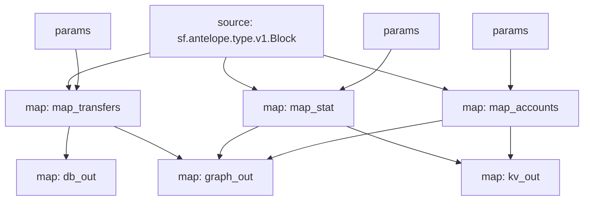

# Antelope `eosio.token` substream

> Antelope `eosio.token` tokens

### [Latest Releases](https://github.com/pinax-network/substreams-antelope-tokens/releases)

### Quickstart

```bash
$ make
$ make gui        # all transfers
```

### Mermaid graph



### Modules

```yaml
Package name: antelope_tokens
Version: v0.2.0
Doc: Antelope `eosio.token` based action traces & database operations.
Modules:
----
Name: map_transfers
Initial block: 0
Kind: map
Output Type: proto:antelope.eosio.token.v1.TransferEvents
Hash: 2df6dc49066ed4ff1b69625f35a8f59e6feb7493

Name: map_accounts
Initial block: 0
Kind: map
Output Type: proto:antelope.eosio.token.v1.Accounts
Hash: 5426087f7b230d47d5ac6ec3e32f65919cc4983c

Name: map_stat
Initial block: 0
Kind: map
Output Type: proto:antelope.eosio.token.v1.Stats
Hash: 8e5cd7c9ab846975e569d9ed6f391932f4465fb9

Name: graph_out
Initial block: 0
Kind: map
Output Type: proto:sf.substreams.sink.entity.v1.EntityChanges
Hash: b56456c9e2bbf5cc6b1710928562fc82c2aec84f

Name: kv_out
Initial block: 0
Kind: map
Output Type: proto:sf.substreams.sink.kv.v1.KVOperations
Hash: 132c99665e0d51e2663c3c183c7b5925b1f60f98

Name: db_out
Initial block: 0
Kind: map
Output Type: proto:sf.substreams.sink.database.v1.DatabaseChanges
Hash: 4669dacc7a2ad011910dc90ce6ab1486e58285c6
```
