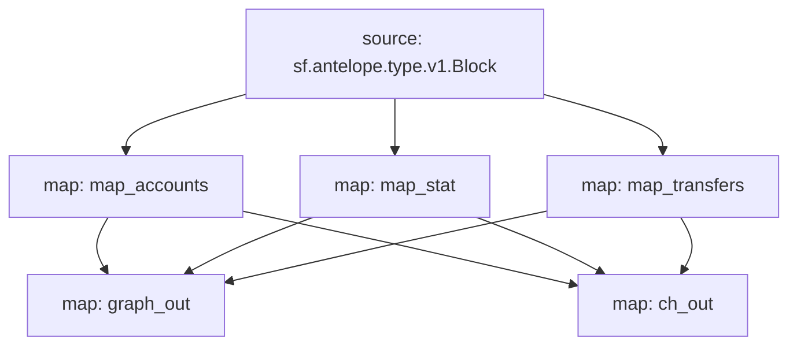

# Antelope `eosio.token` Substream

> Antelope `eosio.token` tokens

### [Latest Releases](https://github.com/pinax-network/substreams-antelope-tokens/releases)

### Quickstart

```bash
$ make
$ make gui
```

### Mermaid graph




### Modules

```yaml
Package name: antelope_tokens
Version: v0.3.5
Doc: Antelope `eosio.token` based action traces & database operations.
Modules:
  ----
Name: map_transfers
Initial block: 0
Kind: map
Input: source: sf.antelope.type.v1.Block
Output Type: proto:antelope.eosio.token.v1.TransferEvents
Hash: 68580bd87f70567d5a794b7ed2c42829563c17a6

Name: map_accounts
Initial block: 0
Kind: map
Input: source: sf.antelope.type.v1.Block
Output Type: proto:antelope.eosio.token.v1.Accounts
Hash: dc10dd69bc5bc0ae08a87724995a97e728158dbd

Name: map_stat
Initial block: 0
Kind: map
Input: source: sf.antelope.type.v1.Block
Output Type: proto:antelope.eosio.token.v1.Stats
Hash: 8124e7464c489fe27ee13e4f1ed80abb4c8b6763

Name: graph_out
Initial block: 0
Kind: map
Input: map: map_accounts
Input: map: map_stat
Input: map: map_transfers
Output Type: proto:sf.substreams.sink.entity.v1.EntityChanges
Hash: d4b1a6dc23e5467da5e613ed76366cd73a43fade

Name: ch_out
Initial block: 0
Kind: map
Input: map: map_accounts
Input: map: map_stat
Input: map: map_transfers
Output Type: proto:sf.substreams.sink.database.v1.DatabaseChanges
Hash: 6f3621429ae1087b55ba3753a1d0cd7cb632948d

Sink config:
  ----
type: sf.substreams.sink.sql.v1.Service
configs:
  - schema: (6376 bytes) MD5SUM: 6c54c43f4c19f465e51cf36c415bc9f6 [LOADED_FILE]
  - dbt_config:
      - files: (empty) [ZIPPED_FOLDER]
      - run_interval_seconds: 0
      - enabled: false
  - wire_protocol_access: false
  - hasura_frontend:
      - enabled: false
  - postgraphile_frontend:
      - enabled: false
  - pgweb_frontend:
      - enabled: false
  - engine: 2
```
