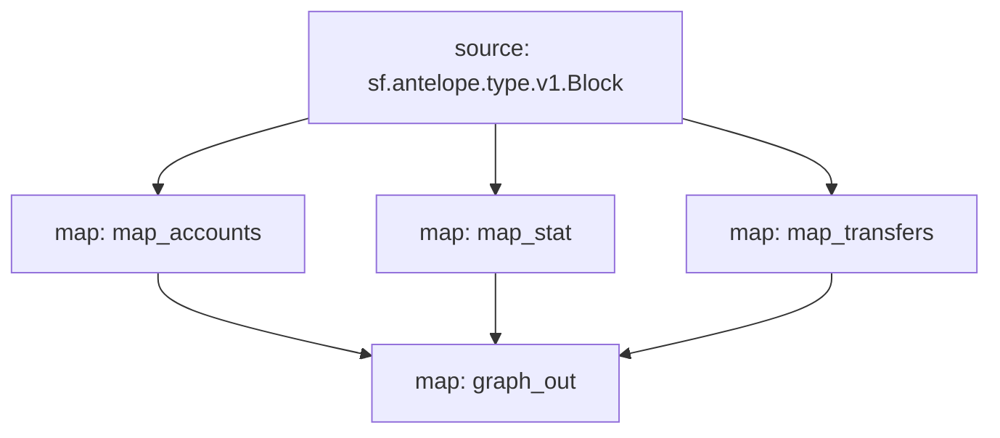

# Antelope `eosio.token` Substream

> Antelope `eosio.token` tokens

### [Latest Releases](https://github.com/pinax-network/substreams-antelope-tokens/releases)

### Quickstart

```bash
$ make
$ make gui
```

### Mermaid graph



### Modules

```yaml
Package name: antelope_tokens
Version: v0.3.1
Doc: Antelope `eosio.token` based action traces & database operations.
Modules:
----
Name: map_transfers
Initial block: 0
Kind: map
Output Type: proto:antelope.eosio.token.v1.TransferEvents
Hash: 207453ead04995fab056af784c0167d99e635a0d

Name: map_accounts
Initial block: 0
Kind: map
Output Type: proto:antelope.eosio.token.v1.Accounts
Hash: e5e8049511bca553f070e6b5e84c2df4d243a87c

Name: map_stat
Initial block: 0
Kind: map
Output Type: proto:antelope.eosio.token.v1.Stats
Hash: a8291577cc0f687f8c07ff9d944c8685dbbbbda9

Name: graph_out
Initial block: 0
Kind: map
Output Type: proto:sf.substreams.sink.entity.v1.EntityChanges
Hash: 6ccd6bb44d4cba8572bece4c677075d3029fea75
```
