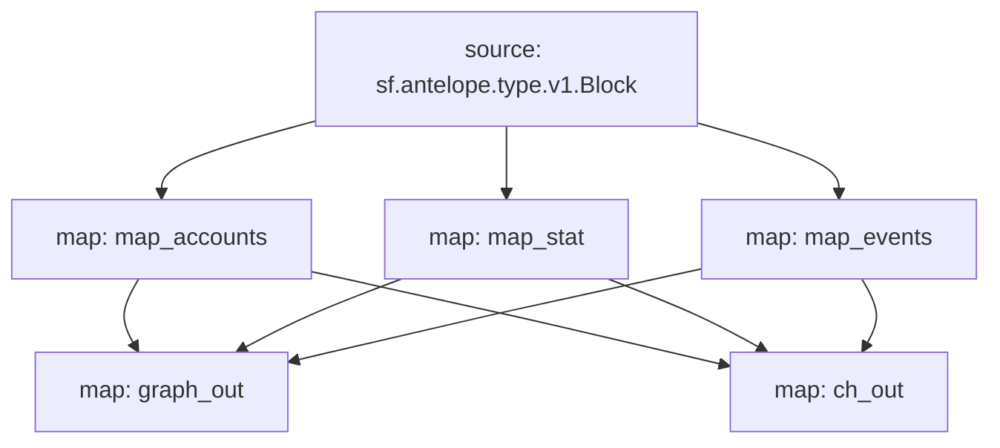

# Antelope `eosio.token` Substream

> Antelope `eosio.token` tokens

### [Latest Releases](https://github.com/pinax-network/substreams-antelope-tokens/releases)

### Quickstart

```bash
$ make
$ make gui
```

### Mermaid graph




### Modules

```yaml
Package name: antelope_tokens
Version: v0.4.0
Doc: Antelope `eosio.token` based action traces & database operations.
Modules:
----
Name: map_events
Initial block: 0
Kind: map
Input: source: sf.antelope.type.v1.Block
Output Type: proto:antelope.eosio.token.v1.Events
Hash: c85c7f8fad2a0d03984c00ee15d1ded54bfa700e

Name: map_accounts
Initial block: 0
Kind: map
Input: source: sf.antelope.type.v1.Block
Output Type: proto:antelope.eosio.token.v1.Accounts
Hash: e85688fa74de76ee66c793b77190025baa242b4a

Name: map_stat
Initial block: 0
Kind: map
Input: source: sf.antelope.type.v1.Block
Output Type: proto:antelope.eosio.token.v1.Stats
Hash: c3ba86b0f3f4fdb79e7e51d82fc114df45abc4f9

Name: graph_out
Initial block: 0
Kind: map
Input: map: map_accounts
Input: map: map_stat
Input: map: map_events
Output Type: proto:sf.substreams.sink.entity.v1.EntityChanges
Hash: 64faa1889da48de19fea8d3b68595f844bba32e9

Name: ch_out
Initial block: 0
Kind: map
Input: map: map_accounts
Input: map: map_stat
Input: map: map_events
Output Type: proto:sf.substreams.sink.database.v1.DatabaseChanges
Hash: f4573a7e43387bde4d3572bb649dc315e64f3913

Sink config:
----
type: sf.substreams.sink.sql.v1.Service
configs:
- schema: (6814 bytes) MD5SUM: adf98a1becc37604e5f14ce2ed6a1629 [LOADED_FILE]
- dbt_config:
  - files: (empty) [ZIPPED_FOLDER]
  - run_interval_seconds: 0
  - enabled: false
- wire_protocol_access: false
- hasura_frontend:
  - enabled: false
- postgraphile_frontend:
  - enabled: false
- pgweb_frontend:
  - enabled: false
- engine: 2
```
