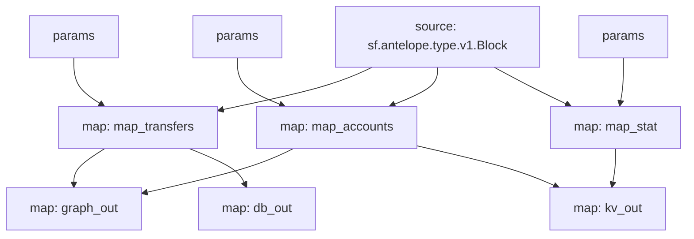

# Antelope `eosio.token` substream

> Antelope `eosio.token` tokens

### [Latest Releases](https://github.com/pinax-network/substreams-antelope-tokens/releases)


### Param
Param allow to filter messages and can be supplied to modules in the form of URL query.

> i.e. `to=swap.defi&contract=eosio.token&symcode=EOS` - filters EOS transfers to `swap.defi` account.

- `map_transfers` - filter transfers
  - `to` - receiver
  - `from` - sender
  - `symcode` - symbol code
  - `contract` - token contract
  - `to_or_from` - either receiver or sender
  - `quantity_lt` - quantity amount **less than**
  - `quantity_lte` - quantity amount **less than or equal to**
  - `quantity_gt` - quantity amount **greater than**
  - `quantity_gte` - quantity amount **greater than or equal to**
- `map_accounts` - filter account balance changes
  - `account` - account
  - `symcode` - symbol code
  - `contract` - token contract
  - `balance_lt` - balance amount **less than**
  - `balance_lte` - balance amount **less than or equal to**
  - `balance_gt` - balance amount **greater than**
  - `balance_gte` - balance amount **greater than or equal to**
  - `balance_delta_lt` - balance delta amount **less than**
  - `balance_delta_lte` - balance delta amount **less than or equal to**
  - `balance_delta_gt` - balance delta amount **greater than**
  - `balance_delta_gte` - balance delta amount **greater than or equal to**
- `map_stat` - filter token stats
  - `symcode` - symbol code
  - `contract` - token contract
  - `supply_lt` - supply amount **less than**
  - `supply_lte` - supply amount **less than or equal to**
  - `supply_gt` - supply amount **greater than**
  - `supply_gte` - supply amount **greater than or equal to**
  - `supply_delta_lt` - supply delta amount **less than**
  - `supply_delta_lte` - supply delta amount **less than or equal to**
  - `supply_delta_gt` - supply delta amount **greater than**
  - `supply_delta_gte` - supply delta amount **greater than or equal to**

### Quickstart

```bash
$ make
$ make gui        # all transfers
$ make param      # swap.defi transfers
```

### Mermaid graph



### Modules

```yaml
Package name: antelope_tokens                                                                                                                        
Version: v0.1.0                                                                                               
Doc: Antelope `eosio.token` based action traces & database operations.                                       
Modules:                                                                                                        
----                                                            
Name: map_transfers
Initial block: 0
Kind: map
Output Type: proto:antelope.eosio.token.v1.TransferEvents
Hash: 66cf12985ab3d190d83182cfa23d2b194755a351

Name: map_accounts
Initial block: 0
Kind: map
Output Type: proto:antelope.eosio.token.v1.Accounts
Hash: c8ec225e244626d16c3dedbfaa3dd10d04a18f3b

Name: map_stat
Initial block: 0
Kind: map
Output Type: proto:antelope.eosio.token.v1.Stats
Hash: 2b4f93397aa39515bbb1822f8d342f327445fa9e

Name: graph_out
Initial block: 0
Kind: map
Output Type: proto:sf.substreams.sink.entity.v1.EntityChanges
Hash: d9702743a9e43e684ce8de6af6eadfd31f5691b8

Name: kv_out
Initial block: 0
Kind: map
Output Type: proto:sf.substreams.sink.kv.v1.KVOperations
Hash: c035415b9306f60d0efde9d4d3acf614fa8323e6

Name: db_out
Initial block: 0
Kind: map
Output Type: proto:sf.substreams.sink.database.v1.DatabaseChanges
Hash: 6b08e7d4db7da04ccd3ab948936f50994ae77c19
```
