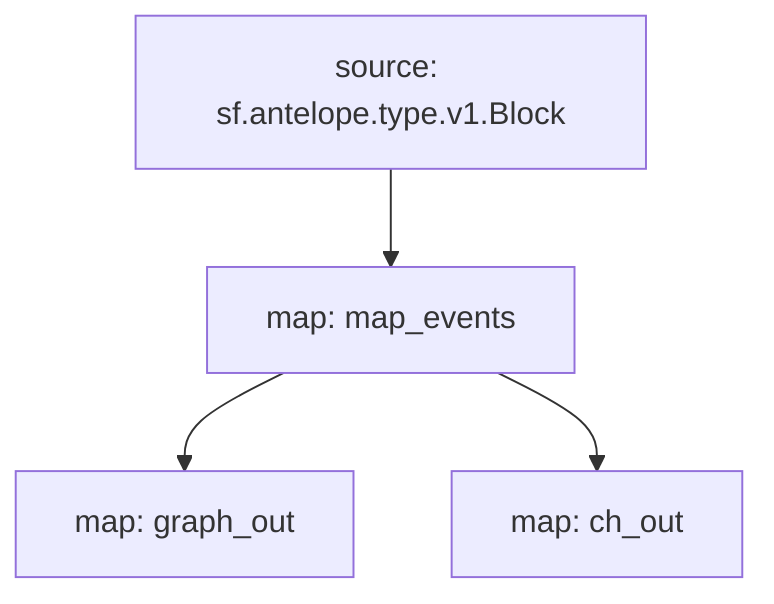

# Antelope `eosio.token` Substream

> Antelope `eosio.token` tokens

### [Latest Releases](https://github.com/pinax-network/substreams-antelope-tokens/releases)

### Quickstart

```bash
$ make
$ make gui
```

### Mermaid graph




### Modules

```yaml
Package name: antelope_tokens
Version: v0.4.0
Doc: Antelope `eosio.token` based action traces & database operations.
Modules:
----
Name: map_events
Initial block: 0
Kind: map
Input: source: sf.antelope.type.v1.Block
Output Type: proto:antelope.eosio.token.v1.Events
Hash: 8dd2fd12c9cb5ad0bb6f32f3b9defcce90090715

Name: graph_out
Initial block: 0
Kind: map
Input: map: map_events
Output Type: proto:sf.substreams.sink.entity.v1.EntityChanges
Hash: b34452f9c92c173f7a9976534b622ad093dad242

Name: ch_out
Initial block: 0
Kind: map
Input: map: map_events
Output Type: proto:sf.substreams.sink.database.v1.DatabaseChanges
Hash: 1515b91545f2d2812ac27fbe5f556dc117d57e20

Sink config:
----
type: sf.substreams.sink.sql.v1.Service
configs:
- schema: (6814 bytes) MD5SUM: adf98a1becc37604e5f14ce2ed6a1629 [LOADED_FILE]
- dbt_config:
  - files: (empty) [ZIPPED_FOLDER]
  - run_interval_seconds: 0
  - enabled: false
- wire_protocol_access: false
- hasura_frontend:
  - enabled: false
- postgraphile_frontend:
  - enabled: false
- pgweb_frontend:
  - enabled: false
- engine: 2
```
